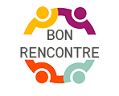

# Bon Rencontre

Plateforme de commerce en ligne en Click & Collect pour le compte de la commune de Notre Dame de l'Osier.

## Requirements

- PHP 8.0
- PostgreSQL
- Composer

## Installation

1. Cloner le projet
2. Lancer la commande "composer install"
3. Copier le .env disponible sur Notion

## Structure de fichiers

- **app/Http/Controllers**
    - Dossier contenant les contrôleurs.
- **app/Models**
    - Dossier contenant les modèles de l'application. 
- **public**
    - Fichiers CSS et JavaScript
- **resources/views**
    - C'est ici que se trouvent les vues
- **resources/views/layouts**
    - C'est ici que se trouvent les layouts pour les vues
- **resources/views/inc**
    - Includes = composants réutilisables et modulaires
- **routes**
    - Tout ce qui concerne les routes et les redirections 

